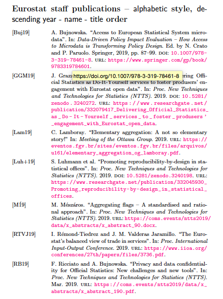
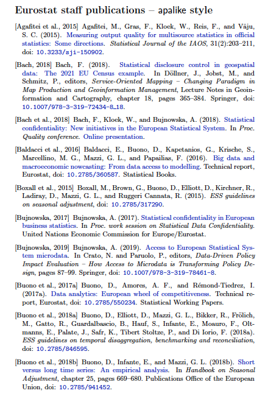
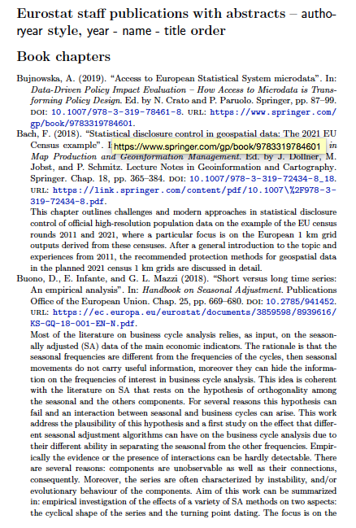
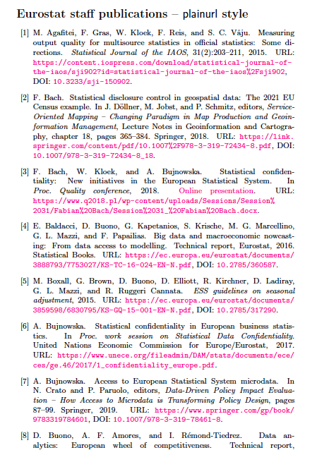
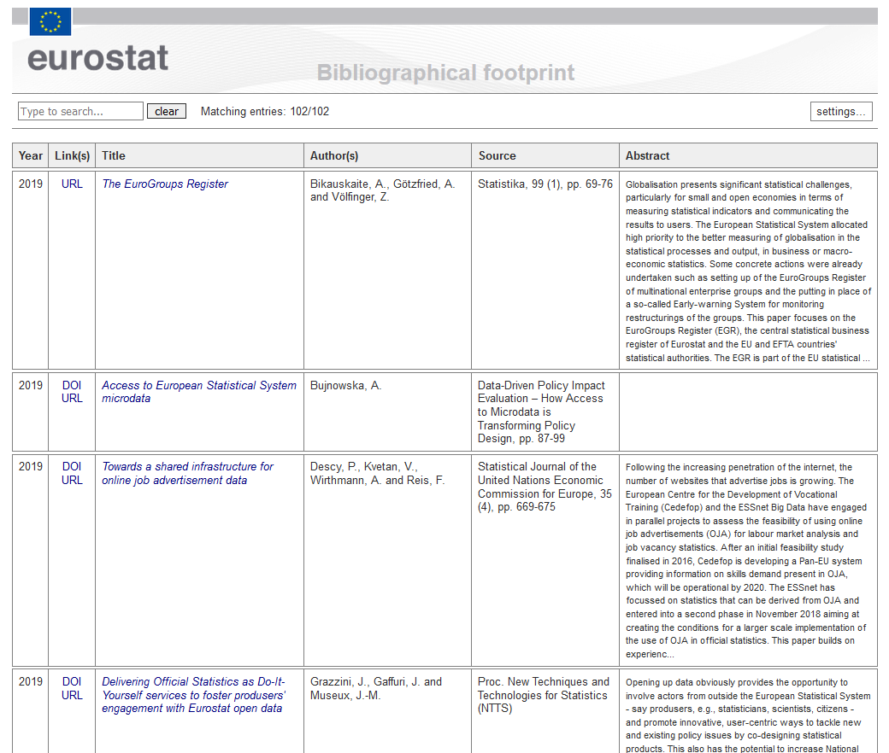

bibestat
======

_Eurostat_ bibliographical footprint.
---

**About**

This provides with a non exhaustive list of **bibliographical references produced by _Eurostat_ staff in recent years**, _e.g._ contributions to journals, conference publications and reports. You can quickly browse through the publications (together with shortened abstracts) at [this address](https://raw.githack.com/eurostat/bibestat/master/html/eurostatref.html). 

Also note the online presence of _Eurostat_ current staff in online libraries, _e.g._ on [_Researchgate_](https://www.researchgate.net/institution/European_Commission/department/Eurostat_ESTAT), _Google Scholar_, etc.... 

**Source**

All reference publications are available in the **_BibTeX_ file [`eurostatref.bib`](eurostatref.bib)**. Use your favourite bibliography reference manager (_e.g._, [`JabRef`](http://www.jabref.org)) to use/manage the database.

**Contents**

To reference _Eurostat_ publications, you can use the source file above, for instance:

*  **[*tex/*](tex)**: in `LaTeX` documents, together with any `BibTeX/BibLaTeX/Biber` bibliography compilers, for instance generating the `pdf` below: 
<table>
<tr>
<td><kbd></kbd></td>
<td><kbd></kbd></td>
<td><kbd></kbd></td>
<td><kbd></kbd></td>
</tr>
</table>

*  **[*html/*](html)**: in `html`, like in the searchable table below (see also link in _About_ section above): 

  This table was produced using `Jabref` export option according to the model explained in http://www.markschenk.com/tools/jabref/. For that purpose, the layout files [`tablerefs-estat.layout`](html/tablerefs-estat.layout), [`tablerefs-estat.begin.layout`](html/tablerefs-estat.begin.layout), and [`tablerefs-estat.end.layout`](html/tablerefs-estat.end.layout) are provided: those can be easily modified following the instructions of the site above. 

*  **[*misc/*](misc)**: various other  formatted outputs, namely, [`Endnote`](misc/eurostatref.txt), [`BibTeXML`](misc/eurostatref.xml), [`RIS`](misc/eurostatref.ris), [`csv`](misc/eurostatref.csv), or `MySQL` by exporting the bibliography with your favourite bibliography reference manager. 

**Notes**

