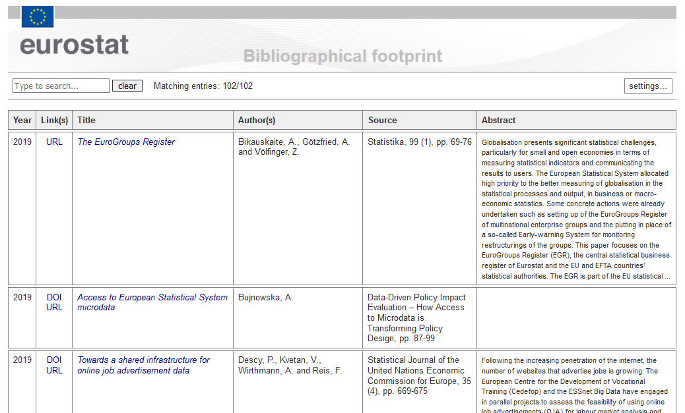

bibestat
======

_Eurostat_ bibliographical footprint.
---

**About**

This site provides with a non exhaustive list of **bibliographical references produced by _Eurostat_ staff in recent years**, _e.g._ contributions to journals, conference publications and reports. You can quickly browse through the publications (together with shortened abstracts) at [this proxy address](https://raw.githack.com/eurostat/bibestat/master/html/eurostatref.html). 

 
Also note the online presence of some of _Eurostat_ current staff in online libraries, _e.g._ on [_Researchgate_](https://www.researchgate.net/institution/European_Commission/department/Eurostat_ESTAT), _Google Scholar_, etc.... 

**Source**

**All _Eurostat_ bibliographical references are listed in the _BibTeX_ [`eurostatref.bib`](eurostatref.bib) bibliography database**. 

**Contents**

To reference _Eurostat_ publications, you can use the source file above, for instance:

*  **[*html/*](html)** : in `html`, like in the searchable table [above](#About). With [`JabRef`](http://www.jabref.org) bibliography reference manager, it is possible to produce such a table by adopting the layout model described in http://www.markschenk.com/tools/jabref/. For that purpose, the customised layout files [`tabref-bibestat.layout`](html/tabref-bibestat.layout), [`tabref-bibestat.begin.layout`](html/tabref-bibestat.begin.layout), and [`tabref-bibestat.end.layout`](html/tabref-bibestat.end.layout) are made available. Those can be easily modified so as to export the bibliography to different layout models. 

*  **[*tex/*](tex)** : in `LaTeX` documents, together with any `BibTeX/BibLaTeX/Biber` bibliography compilers, generating `pdf`'s like in the examples below: 
<table>
<tr>
<td><kbd></kbd></td>
<td><kbd></kbd></td>
<td><kbd></kbd></td>
<td><kbd></kbd></td>
</tr>
</table>

*  **[*misc/*](misc)** : in many different formats, namely, [`Endnote`](misc/eurostatref.txt), [`BibTeXML`](misc/eurostatref.xml), [`RIS`](misc/eurostatref.ris), [`csv`](misc/eurostatref.csv), or `MySQL` by exporting the `eurostatref.bib` bibliography database with your favourite bibliography reference manager. 

* in `Microsoft Word` using the [`Bibtex4Word`](http://www.ee.ic.ac.uk/hp/staff/dmb/perl/index.html) add-in macro.

**Notes**

Use your favourite [bibliography reference manager](https://en.wikipedia.org/wiki/Comparison_of_reference_management_software) to handle/manage/edit the bibliography database. For instance, using `JabRef` again:

When adding a reference publication, use common [bibliography rules](https://en.wikipedia.org/wiki/Citation). Additionally, consider [standard `LaTeX` syntax](https://en.wikibooks.org/wiki/LaTeX/Bibliography_Management) for bibliography. Last, also take into account the existing strings (see header of `eurostatref.bib` bibliography database) for editing.
